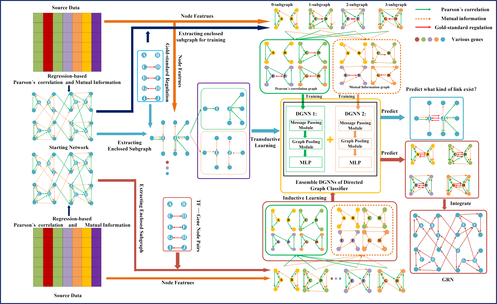

## An End-to-End Gene Regulatory Directed Graph Neural Network Schema

=====================================================================================================

About
-----

GRDGNN is an end-to-end supervised learning framework for constructing gene regulatory networks from gene expression data. Initially, it builds an initial regulatory network from gene expression data, extracts gene pair subgraphs, and subsequently learns low-dimensional vector representations of the subgraphs through message propagation and graph pooling.

Preprocessing data is provided, readers can use the data directly or generate the data by downloading the DREAM5 challenge data and scRNA-seq data from https://www.synapse.org/#!Synapse:syn3130840 and https://doi.org/10.5281/zenodo.3378975, respectively.

## Requirements
- Tested with Python 3.8.16, Pytorch 1.12.1 on Ubuntu 18.04
- Required python libraries:
  - scikit-learn==1.2.1
  - numpy== 1.23.5 
  - pandas==1.5.2
  - matplotlib==3.6.2
  - scanpy==1.10.0
  - torch-geometric==2.3.0
  - networkx==2.8.4
  - tqdm==4.64.1

## Usages

The GRDGNN framework enables both transductive inference learning to deduce potential explicit regulatory relationships in existing regulatory networks and inductive learning to infer unknown gene regulatory networks based on known ones.

The complete running process of GRDGNN, taking dataset DREAM5 as an example, only requires adjustments to the corresponding folders for dataset SingleCell.
- **Step 1: Processing source data**

    python /path/to/GRDGNN/code/DataPreprocessing/DREAM5/ExpressionDataProcessing.py

    python /path/to/GRDGNN/code/DataPreprocessing/DREAM5/read_expression_and_goldGRN.py

- **Step 2: Constructing the initial directed networks from the gene expression data**

    python /path/to/GRDGNN/code/DataPreprocessing/DREAM5/calculateMutInfoStartingNoisyNetwork.py

    python /path/to/GRDGNN/code/DataPreprocessing/DREAM5/calculatePreasonStartingNoisyNetwork.py

- **Step 3: Constructing the inputs from the initial directed networks, training and testing on the ensemble DGNN classifier**

- Transductive
  - BinaryClassification
  - MultiClassification

      
    python /path/to/GRDGNN/code/Transductive/BinaryClassification/DREAM5/main_ensemble_3crossval_net3.py

    python /path/to/GRDGNN/code/Transductive/DREAM5/BinaryClassification/main_ensemble_3crossval_net4.py

    python /path/to/GRDGNN/code/Transductive/DREAM5/MultiClassification/main_ensemble_3crossval_net3.py

    python /path/to/GRDGNN/code/Transductive/DREAM5/MultiClassification/main_ensemble_3crossval_net4.py

- Inductive
    - MultiClassification
  

    python /path/to/GRDGNN/code/Inductive/DREAM5/MultiClassification/main_ensemble_train_net4_test_net3.py

    python /path/to/GRDGNN/code/Inductive/DREAM5/MultiClassification/main_ensemble_train_net3_test_net4.py

## Attention

- **In scRNA-seq dataset, data processing requires an initial transformation of the scRNA-seq data before proceeding with steps 1, 2.**
    
    
    python /path/to/GRDGNN/code/DataPreprocessing/DREAM5/ExpressionDataProcessing.py

- **For binary classification in scRNA-seq transductive inference, we adopt the same partitioning as GENELink. Therefore, it is necessary to run "data2Genelink.py" and "Train_test_split.py".**
  

    python /path/to/GRDGNN/code/Transductive/BinaryClassification/SingleCell/CompareWithGENELink/data2Genelink.py

    python /path/to/GRDGNN/code/Transductive/BinaryClassification/SingleCell/CompareWithGENELink/Train_test_split.py

References:
------------
1. DREAM5 data: http://dreamchallenges.org/project/dream-5-network-inference-challenge/
2. scRNA-seq data: https://doi.org/10.5281/zenodo.3378975
